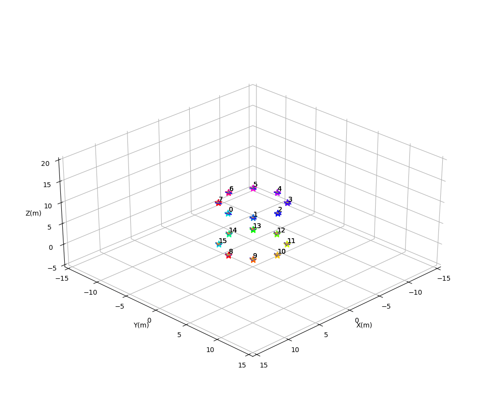
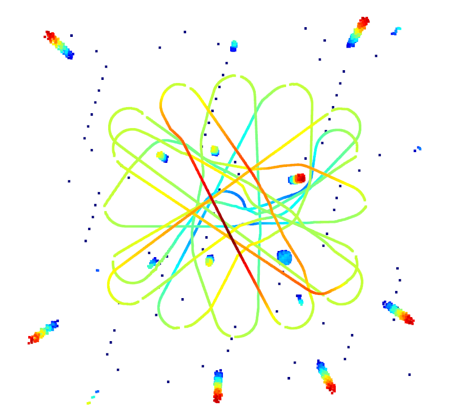

## Shunted Collision Avoidance (SCA) for Multi-Agent Motion Planning in Three Dimensions

Python Implementation of shunted collision avoidance for multiple fixed-wing UAVs motion planning.

-----

Description
-----

We present an approach for fixed-wing UAVs' collision avoidance, where multiple independent mobile UAVs or agents need to avoid collisions without communication among agents while moving in a common 3D workspace. We named the proposed method as shunted collision avoidance (SCA). In addition, we provide the optimal reciprocal collision avoidance (ORCA) method and reciprocal velocity obstacles (RVO) method in 3D domains for comparison.

About
-----

**Paper**:  Shunted Collision Avoidance for Multiple Fixed-Wing UAVs Motion Planning, Gang Xu, Junjie Cao\*, Deye Zhu,  Yong Liu\*, and Jian Yang, Submitted in IEEE Robotics and Automation Letters (**RA-L**).


-----

Requirement
-----

```python
pip install numpy
pip install open3d
pip install pandas
pip install matplotlib
```

-----

Applications
-----

```python
cd run_example
python run_sca.py
For the test, you can select the scenarios, including circle, random, take-off and landing, etc.
```

#### The scenario of circle for simulating air patrol task.

<p align="center">
    
</p>


#### The scenario of take-off and landing.

<p align="center">
    
</p>
<p align="center">
    
</p>


#### The scenario of circle for simulating low altitude flying for search task.

<p align="center">
    
</p>


#### Results of Comparison 1 (Ours: S-RVO3D):

<p align="center">
    
</p>


#### Results of Comparison 2 (Ours: SCA):

<p align="center">
    
</p>


----

References 
----

* Papers on [RVO](https://www.cs.unc.edu/~geom/RVO/icra2008.pdf), [ORCA](https://gamma.cs.unc.edu/S-AIRPLANE/S-AIRPLANE.pdf).


----

Discussion
----

In the first comparison, the UAVs' number is 100.
